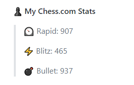

# Chess.com Stats in Readme



## Update your Readme

Add a these comment to your `README.md`:

```md
<!--START_SECTION:Chess-->
<!--END_SECTION:Chess-->
```

You can place these lines anywhere you want to display your chess ratings.

### Profile Repository

You'll need to get a [GitHub Access Token](https://docs.github.com/en/actions/configuring-and-managing-workflows/authenticating-with-the-github_token) with a `repo` scope and save it in the Repo Secrets by name `GH_TOKEN` , click [here](https://github.com/settings/tokens) to create an access token.

Here is a sample workflow file for running it:

```yml
name: Chess Stats Readme

on:
  schedule:
    # Runs at 12am IST
    - cron: "30 18 * * *"
jobs:
  update-readme:
    name: Update readme with chess stats
    runs-on: ubuntu-latest
    steps:
      - uses: Prathamesh-B/chess-stats-readme@master
        with:
          GH_TOKEN: ${{ secrets.GH_TOKEN }}
          CHESS_USERNAME: <Your Chess.com Username>
```

- Now you can commit and wait for it to run automatically.

## Contributing

Pull requests are welcome. For major changes, please open an issue first to discuss what you would like to change.

Please make sure to update tests as appropriate.

## License

[MIT](https://choosealicense.com/licenses/mit/)

## Inspired From

[anmol098/waka-readme-stats](https://github.com/anmol098/waka-readme-stats)
